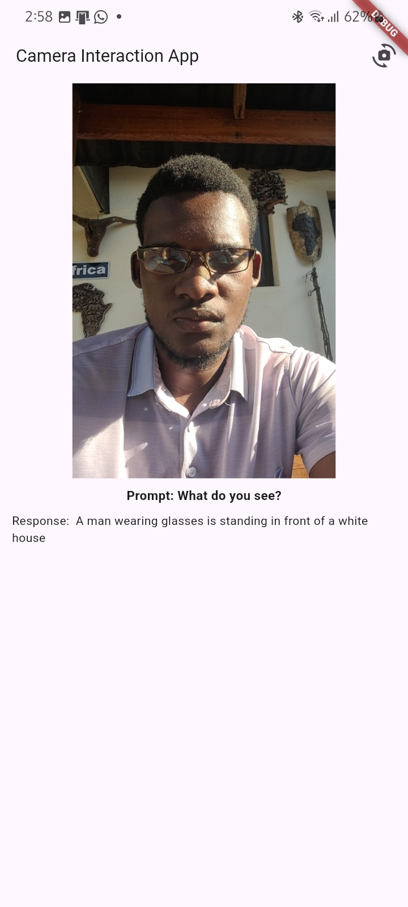
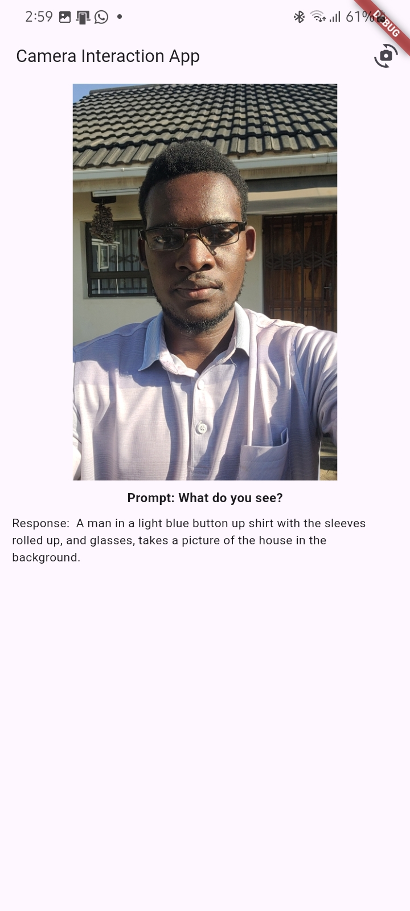
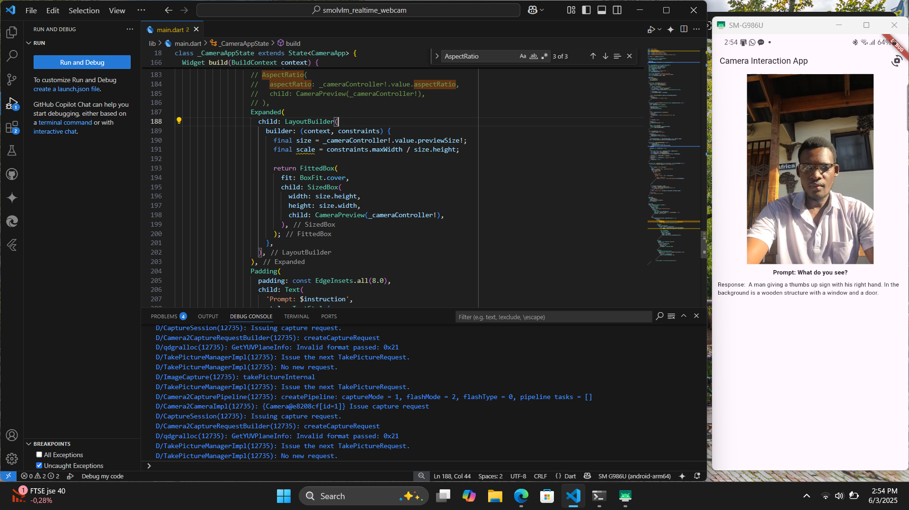

# 📸 SmolVLM Flutter App

🔥 A real-time AI camera assistant built entirely with Flutter and LLaMA.cpp — works offline, no cloud needed.

## 🧠 What It Does

- Captures live images from your mobile camera
- Sends them to a local LLaMA.cpp multimodal server
- Uses SmolVLM-500M to generate smart, natural language descriptions of what it sees
- Works in real-time and fully offline

## ✨ Features

- 🌐 No internet required — local AI inference
- 📷 Front & back camera support with seamless switching
- 🔄 Sends frames to the AI server every few seconds
- 🧠 Powered by SmolVLM + LLaMA.cpp
- 🧼 Handles preview stretching and UI glitches

## 📷 Screenshots

  
  

 
  

## 🛠 Tech Stack

- **Frontend:** Flutter + Dart + Camera plugin
- **AI Model:** SmolVLM-500M-Instruct-f16.gguf
- **Backend Server:** llama-server (from LLaMA.cpp)
- **Communication:** Base64-encoded images → AI → Natural language response

## 🧪 How to Run

1. Clone this repo:
   - git clone https://github.com/brianmahove/SmolVLM-Flutter-App.git
   - cd SmolVLM-Flutter-App
Install Flutter dependencies:
-flutter pub get

Make sure llama-server is running locally (with your GGUF model loaded).
Run the app:
- flutter run
Note: You need a device/emulator with a working camera.

📦 Model + Server Setup
Download llama-server
-Use the SmolVLM-500M-Instruct-f16.gguf model

Run:
- ./llama-server -m ./models/SmolVLM-500M-Instruct-f16.gguf

Let’s connect if you're working on mobile AI, computer vision, or LLMs.

#Flutter #AI #LLaMAcpp #SmolVLM #MobileApp #ComputerVision
